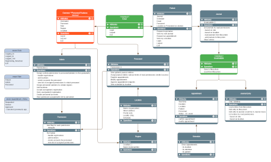

# Healthcare System
A console based program written in C# (.NET 9) where users manage patient healthcare data, administrative tasks and complete patient documentation.

The project was created in collaboration with other NBI students as a group assignment for learning purposes.

### Learning objectives
Familiarizing project members with version control strategies like using branches to support parallel feature development and code review to increase code quality were key skill development goals.

Utilizing github features such as creating millstones and issues to track goal progression and promote development of collaborative communication around workflow, problem identification and resolution were additional skill development goals.

Lastly, producing the minimal viable product (MVP) was emphasized as a key decision making condition when considering design options or feature expansions.

## ✔️ System requirements:
- [ ] security and safety: limit user access to information based on role
- **Users**
  - [ ] login
  - [ ] logout
  - [ ] request registration as a patient
  - [ ] once logged in: view my schedule
- **Admin user**
  - [ ] assign personnel to regions
  - [ ] add locations
  - [ ] accept user registration as a patient
  - [ ] deny user registration as a patient
  - [ ] create personnel accounts
  - [ ] view the permissions list
  - [ ] assign permissions for the permission system in fine granularity including:
    - [ ] permission to handle registrations
    - [ ] permission to add locations
    - [ ] permission to create personnel accounts
    - [ ] permission to view the permissions list
- **Personnel user**
  - [ ] view patients journal entries
  - [ ] assign journal entries various levels of read permissions
  - [ ] register appointments
  - [ ] modify appointments
  - [ ] approve appointment requests
  - [ ] view schedule by location
- **Patient user**
  - [ ] view own journal
  - [ ] request an appointment

<!--
### Future feature creeps
- [ ] implement dictionary for user accounts
- [ ] Approve/deny registration requests without exiting registration menu
-->

## 🚀 How to Run
```
git clone git@github.com:hkmp1303/Healthcare_System.git

cd Healthcare_System

dotnet run
```

## 🦮 Quick guide
Follow on screen console prompts throughout the system. Menus will display key characters for user selection to navigate the program.

## 🖌️ Design Structure
The goals of this project include to practice using OOP, state machine design and collaboration with multiple project contributors.

In accordance with state machine design, as internal program states change these changes alter object behavior.

### Data
The project uses CSV files for persistent data storage between sessions. The CSV file updates when data changes occur.

### Project structure


Fullview of UML class diagram can be accessed [here](https://www.yworks.com/yed-live/?file=https://gist.githubusercontent.com/hkmp1303/ce4ffc1ec8558003ab33a2dafa426a9b/raw/53ffb886dc941c9a6d531614947ff905c4858f30/Healthcare%20System).
